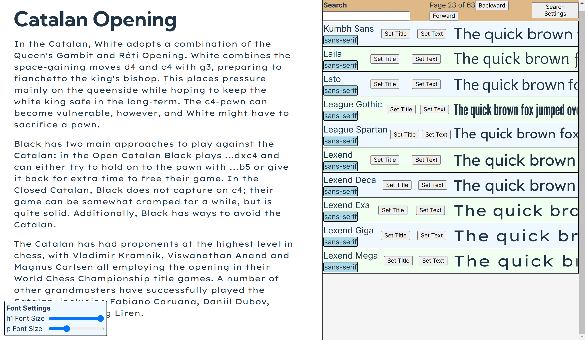

# Font Finder

Web application for easy search and use of fonts.

## Summary

[Google Fonts](https://fonts.google.com) is useful, but it's not optimal for me:

- The user interface is confusing
- It is a nuisance to use fonts (they must be downloaded, extracted, and moved to the current project directory)
- It is a nuisance to preview fonts in-context

```console
git clone git@github.com:fox-incubator/font-finder
cd ./font-finder
# Clone https://github.com/google/fonts to "./google-fonts-repository (clone or zip download)
node server.js
pnpm run dev
```


